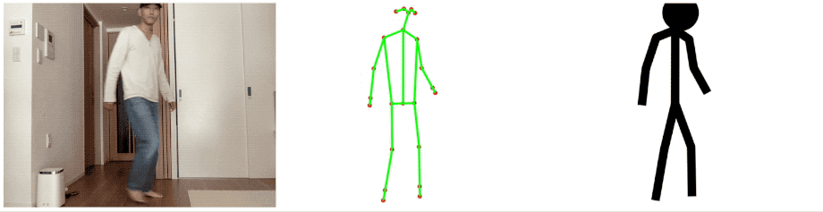

# Stick Figure Recorder
Website to generate stick figure gifs from webcam recordings.

We use Google's [PoseNet](https://github.com/tensorflow/tfjs-models/tree/master/posenet) to detect your pose features from a webcam video stream, and then convert the features into a stick figure drawing, which can be exported as a gif file.

The website is currently hosted here: http://stickfigure-recorder.web.app/.

